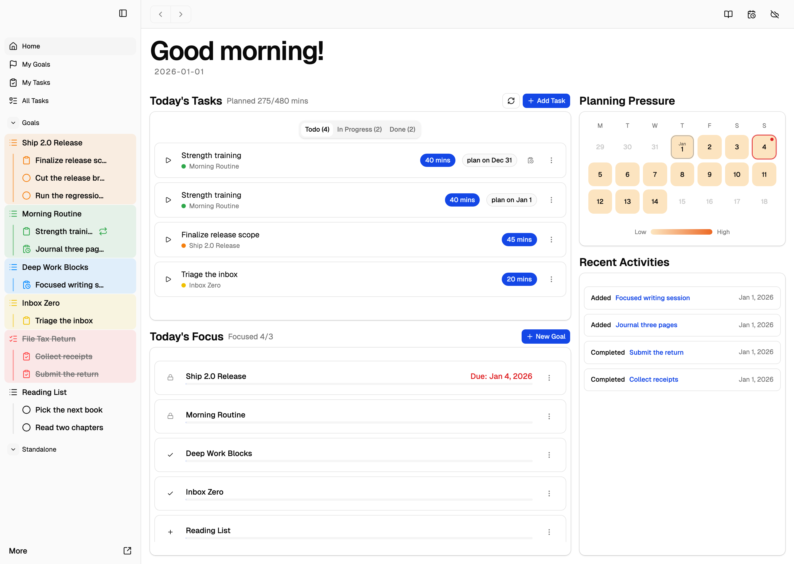
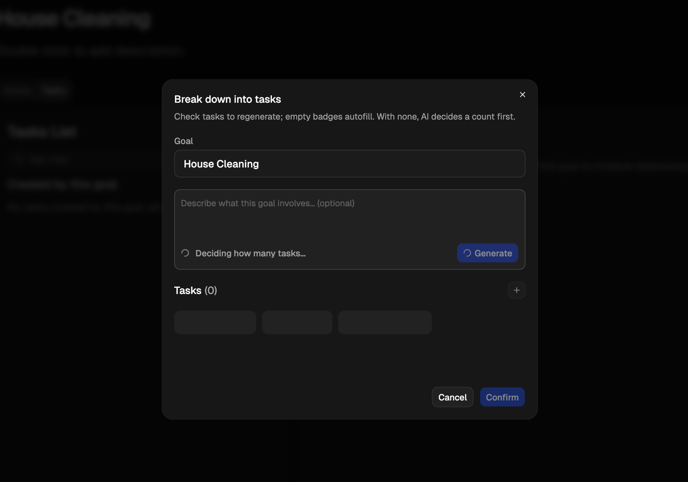

<div align="center">


# TSAT

> A daily planner that focuses on turning long-term goals into some small tasks.

[](https://github.com/Fan-7SZ/tsat/actions/workflows/build.yml)
[](https://github.com/Fan-7SZ/tsat/actions/workflows/unit.yml)
[](https://github.com/Fan-7SZ/tsat/actions/workflows/e2e-coverage.yml)
[](https://github.com/Fan-7SZ/tsat/actions/workflows/e2e-coverage.yml)
[](LICENSE)

</div>

TSAT is built on one idea: **break a goal into small tasks, hand the tracking over, and focus on doing.** You split your goals into concrete tasks; TSAT takes charge of everything around them — where each goal stands, what is done, what comes next — so your attention stays on the task in front of you, not on managing the list. Automatic management tools (daily planning, repeat schedules, time budgeting) and optional AI assistance are there whenever you want to lean on them.

Everything runs in your browser. There is no account, no backend, and no tracking.

## Try it

**Live app: <https://tsat.oneshama.com/>**

TSAT is a **PWA** — install it from the browser (address-bar install icon, or "Add to Home Screen" on mobile) and it works **fully offline**. All features, including planning and history, are available without a network connection; the app updates itself when a new version ships.

Available in **English and 中文** (switchable in settings). See the [user guide](https://tsat.oneshama.com/doc/concepts/core) for concepts and walkthroughs.

## Features

- **Goals & task chains** — split a goal into tasks, link prerequisites; only what's actually actionable shows up (flow + Gantt views).
- **Automatic daily planning** — a "today" list assembled for you from focus, due dates and available time; your own picks always come first.
- **Repeats that don't forget** — a missed day shows up as debt to resolve, not a silent reset.
- **Triggers** — cyclic goals that re-arm themselves on schedule ("every Monday, reset the weekly checkup").
- **AI assist (optional)** — break down tasks and suggest dependencies, with your own OpenRouter / DeepSeek key.
- **Cloud sync (optional)** — sync devices through your own Google Drive / OneDrive. Works out of the box on the official app; self-deployments can [run their own relay](#cloud-sync).




## Privacy

**TSAT collects no user data. None.**

- All data lives in your browser (IndexedDB on your device). There is no application server and no database behind the app.
- No analytics, no telemetry, no cookies, no error reporting — beyond fetching its own static files, the app makes zero network requests in normal use.
- With **sync** enabled, data goes only to **your own** Google Drive / OneDrive app folder.
- With **AI assist** enabled, prompts go directly from the browser to the provider configured with your own API key.

Deleting your browser data (or the installed PWA) deletes everything.

## Self-deploy

TSAT is a static site — any static host works (Cloudflare Pages, Netlify, GitHub Pages, your own nginx).

```bash
npm ci
npm run build     # outputs dist/
```

- **Cloudflare Pages**: point the project at this repo, build command `npm run build`, output directory `dist`. Done — the app is fully functional without any environment variables.
- **Optional env var** `VITE_AUTH_WORKER_URL` — only needed for cloud sync (next section). Set it in the host's build environment (CF Pages: Settings → Environment variables); it is baked into the client bundle at build time.
- Local development: `npm run dev` (copy `.env.example` to `.env.local` if sync is used).

## Cloud sync

Your data syncs through your own Google Drive / OneDrive app folder — the app talks to your cloud storage directly from the browser. The only server-side piece is a tiny **stateless OAuth relay worker** that handles the token exchange and stores nothing.

**On the official app, sync works out of the box** — just connect your Google / Microsoft account in sync settings; the hosted relay is already in place.

**Self-deployments** can run their own relay. Companion [repo](https://github.com/Fan-7SZ/outh-worker)

Setup outline (details in the worker repo):

1. Deploy the worker to Cloudflare Workers.
2. Register OAuth apps — Google (Drive `appDataFolder` scope) and/or Microsoft (OneDrive App Folder) — and put their client IDs/secrets in the worker's environment.
3. Restrict the worker's allowed origins / registered redirect URIs to **your** app domain (this, not URL secrecy, is the security boundary).
4. Set `VITE_AUTH_WORKER_URL` to the worker URL when building the app.

Each device writes its own snapshot file; devices merge with record-level last-write-wins and 90-day tombstones. Disconnecting a device or wiping the cloud copy is always available from sync settings.

## Development

```bash
npm run dev            # Vite dev server
npm test               # unit tests (vitest, node)
npm run test:storybook # component tests (vitest + storybook, real chromium)
npm run test:e2e       # Playwright e2e (simulated-clock harness, incl. a two-month run)
npm run test:coverage:all && npm run test:e2e:coverage && npm run coverage:merge
                       # three-layer merged coverage report → coverage/merged/html
```

The test suite is a first-class part of this project: ~1200 unit/component tests plus an e2e harness that drives the real UI through a simulated two-month timeline (injected clock) to verify cross-day planning, repeat debt, and sync invariants. Merged statement coverage sits around 75%+, with all logic layers above 95%.

## Contributing

Issues, ideas and forks are all welcome.

- **Bugs / feature requests** → open an issue.
- **Pull requests** → There are four check actions before PR, and you can run them locally through NPM on your computer to save time.
- Really Welcome more ideas about testing workflow.

## Why TSAT exists

TSAT started with a kind request from a friend, and one simple idea: split a goal into small tasks, so you can knock them out one by one. Frankly, I also just wanted to build something real in React to understand the framework better. Then the first version came out, and I thought — why not make it a big toy? A place to try more frameworks, more API handling, testing workflows, even developing side by side with LLMs. And here it is. It would be my honor if this toy project helps you in your daily life :)

## License

[MIT](LICENSE)


